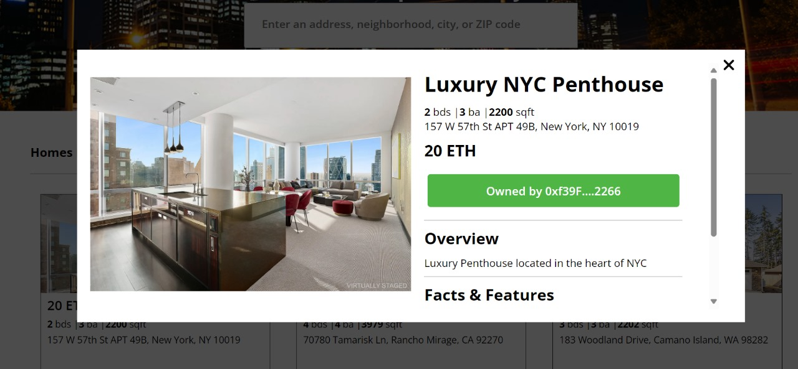

# Real Estate NFT DApp

## Technology Stack & Tools
- Decetralized application to buy Real Estate using NFTs
- Solidity (Writing Smart Contracts & Tests)
- Javascript (React & Testing)
- [Hardhat](https://hardhat.org/) (Development Framework)
- [Ethers.js](https://docs.ethers.io/v5/) (Blockchain Interaction)
- [React.js](https://reactjs.org/) (Frontend Framework)
- [Metamask](https://metamask.io) (ETH Transaction)

